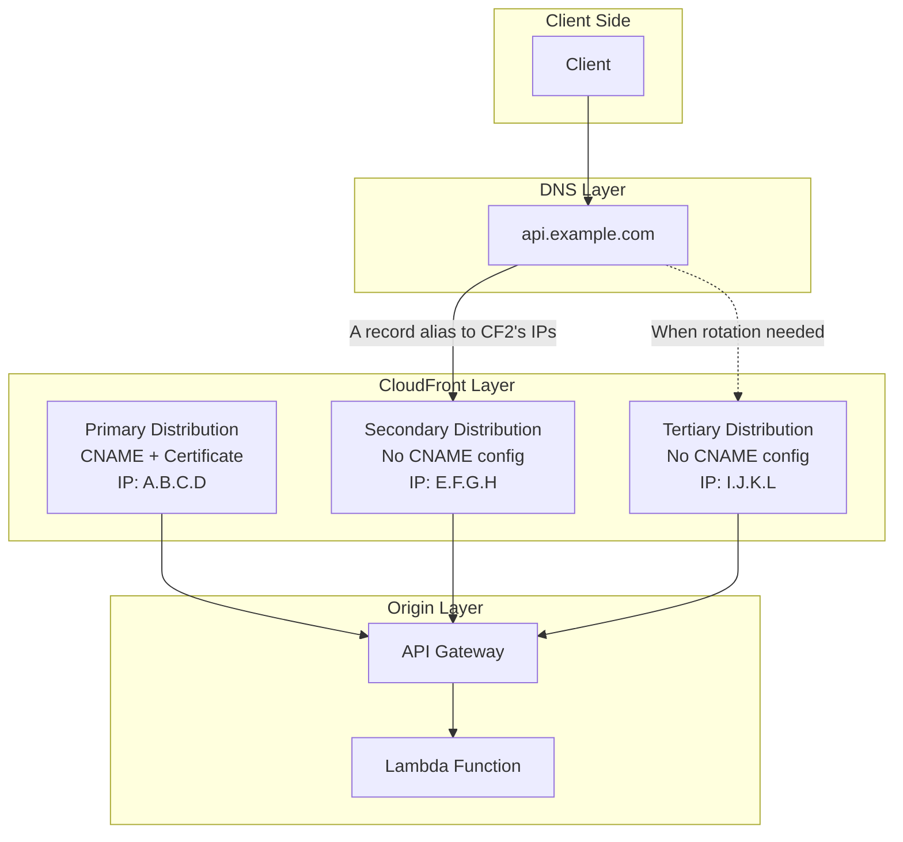
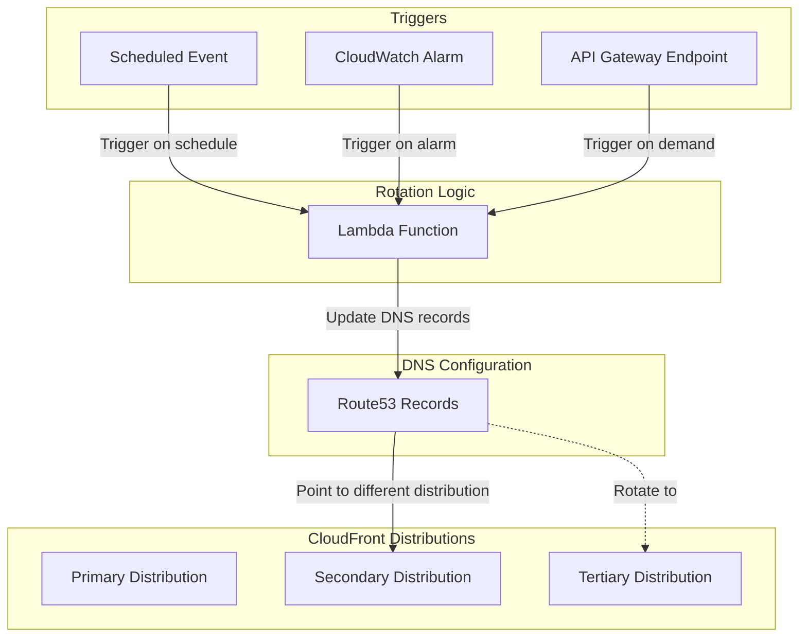

# CloudFront IP Rotation Architecture

This reference architecture demonstrates how to implement IP rotation for your web applications using multiple CloudFront distributions with a unique approach to DNS configuration. This solution allows you to change the public-facing IP addresses of your application without modifying the underlying CloudFront distribution settings.

## Overview

IP rotation can be useful in several scenarios:
- Bypassing IP-based rate limiting or blocking
- Avoiding IP-based geolocation restrictions
- Implementing failover mechanisms for IP-based restrictions
- Maintaining service availability when specific IPs are blocked

## Architecture Diagram



## How It Works

This solution uses a unique approach to IP rotation:

1. **Primary Distribution**: Configured with the proper CNAME and SSL certificate for your domain (e.g., api.example.com).

2. **Secondary Distribution**: Has no CNAME configuration but is used for its CloudFront IP addresses. The DNS record for your domain points to this distribution's IPs through an Alias record.

3. **Tertiary Distribution**: Acts as a placeholder with no initial DNS configuration. When IP rotation is needed, you update the DNS Alias record to point to this distribution's IPs instead.

4. **Same Origin**: All CloudFront distributions point to the same backend (API Gateway + Lambda).

5. **Scalable Architecture**: While this example uses three distributions, you can add more distributions as needed for additional IP rotation options. Simply add more CloudFrontDistributionConstruct instances in the MainStack.

The key insight is that the DNS record points to one distribution's IPs while the actual domain name and certificate are configured on a different distribution.

## Project Structure

- `/lambda` - Contains the Lambda function code
- `/lib` - Contains the CDK stack definitions:
  - `lambda-construct.ts` - Defines the Lambda function and API Gateway
  - `cloudfront-distribution-construct.ts` - Defines a CloudFront distribution
  - `main-stack.ts` - Main stack that combines all components

## Deployment Instructions

### Prerequisites

- AWS Account
- AWS CLI configured with appropriate permissions
- Node.js and npm installed
- AWS CDK installed (`npm install -g aws-cdk`)

### Basic Deployment

To deploy this stack to your AWS account:

```bash
npm install
npm run build
npx cdk deploy --context hostedZoneId=YOUR_HOSTED_ZONE_ID \
               --context zoneName=YOUR_ZONE_NAME \
               --context primaryRecordName=YOUR_PRIMARY_RECORD_NAME
```

### Deployment with Custom Domains

To deploy with custom domains, provide the hosted zone ID, zone name, and primary record name as context variables:

```bash
npm install
npm run build
npx cdk deploy --context hostedZoneId=Z1234567890ABC \
               --context zoneName=example.com \
               --context primaryRecordName=api
```

This will create:
- Primary distribution with CNAME and certificate for api.example.com
- Secondary distribution with DNS alias pointing to it
- Tertiary distribution ready for IP rotation

### Configuration Parameters

These three parameters are required for the solution to work:

| Parameter | Description |
|-----------|-------------|
| `hostedZoneId` | Route53 hosted zone ID |
| `zoneName` | Domain name (e.g., example.com) |
| `primaryRecordName` | Subdomain for primary distribution with CNAME config |

## IP Rotation Process

When you need to rotate IPs (for example, if the current IPs are blocked), you have several options:

### Option 1: Using AWS CLI/API

1. **Identify Current Active Distribution**: Determine which CloudFront distribution's IPs are currently being used (initially the secondary distribution).

2. **Update DNS Records**: Modify your Route53 configuration to point your domain's A record alias to the tertiary distribution instead:

   ```bash
   aws route53 change-resource-record-sets \
     --hosted-zone-id YOUR_HOSTED_ZONE_ID \
     --change-batch file://dns-change.json
   ```
   
   Example `dns-change.json` (switching from secondary to tertiary distribution):
   ```json
   {
     "Changes": [
       {
         "Action": "UPSERT",
         "ResourceRecordSet": {
           "Name": "api.example.com",
           "Type": "A",
           "AliasTarget": {
             "HostedZoneId": "Z2FDTNDATAQYW2",
             "DNSName": "d9876xyzabc.cloudfront.net", 
             "EvaluateTargetHealth": false
           }
         }
       }
     ]
   }
   ```

### Option 2: Using CDK MainStack

You can also rotate IPs by modifying the MainStack and redeploying:

1. **Modify the MainStack**: Update the `createAlias` parameters in the MainStack to switch which distribution is used for the alias:

   ```typescript
   // To use the secondary distribution for the alias (default)
   const secondaryDistribution = new CloudFrontDistributionConstruct(this, 'CloudFrontDistribution1', {
     // other parameters...
     createAlias: true,
   });
   
   const tertiaryDistribution = new CloudFrontDistributionConstruct(this, 'CloudFrontDistribution2', {
     // other parameters...
     createAlias: false,
   });
   
   // To switch to the tertiary distribution for the alias
   const secondaryDistribution = new CloudFrontDistributionConstruct(this, 'CloudFrontDistribution1', {
     // other parameters...
     createAlias: false,
   });
   
   const tertiaryDistribution = new CloudFrontDistributionConstruct(this, 'CloudFrontDistribution2', {
     // other parameters...
     createAlias: true,
   });
   ```

2. **Redeploy the Stack**:
   ```bash
   npm run build
   npx cdk deploy --context hostedZoneId=YOUR_HOSTED_ZONE_ID \
                  --context zoneName=YOUR_ZONE_NAME \
                  --context primaryRecordName=YOUR_PRIMARY_RECORD_NAME
   ```

3. **Wait for Deployment**: Allow time for the CloudFormation stack to update and DNS changes to propagate (typically 5-30 minutes).

4. **Verification**: Confirm that your domain is now using the new IP addresses.

### Option 3: Automated Rotation

You can implement automated IP rotation using several approaches:



1. **Scheduled Lambda Function**: Create a Lambda function that runs on a schedule (using EventBridge rules) to rotate IPs at regular intervals.

2. **Alarm-Based Rotation**: Set up CloudWatch alarms to monitor for specific conditions (like increased error rates or latency) and trigger IP rotation automatically.

3. **Manual Trigger with API**: Create an API endpoint that allows authorized users to trigger rotation on demand.

These automation options can be combined with monitoring to create a robust IP rotation strategy that responds to your specific needs.

## Monitoring and Verification

After rotating IPs, you can verify the change using:

```bash
dig +short api.example.com
```

Or use a tool like https://www.whatismyip.com/ to confirm the IP address has changed.

## Custom Domain Configuration

When you provide a hosted zone ID and zone name, the stack will:

1. Create ACM certificates for each domain
2. Set up Route53 DNS validation records
3. Configure CloudFront distributions to use the custom domains
4. Create Route53 A records pointing to the CloudFront distributions (if createAlias is true)

## Disclaimer

This architecture is provided as a reference implementation and should be adapted to your specific requirements. Consider the following:

- **AWS Costs**: Running multiple CloudFront distributions will incur additional costs.
- **DNS TTL**: DNS changes may not be immediate due to caching. Configure appropriate TTL values.
- **CloudFront IP Ranges**: CloudFront uses a range of IP addresses that can change over time. AWS publishes these ranges in their [IP address ranges](https://docs.aws.amazon.com/general/latest/gr/aws-ip-ranges.html) documentation.
- **Not for Malicious Use**: This architecture is intended for legitimate use cases only. Do not use it to circumvent security measures or for any illegal activities.
- **Rate Limiting**: Some services may implement rate limiting based on factors other than IP address.
- **Certificate Validation**: The SSL certificate is only configured on the primary distribution, but clients connect through the IPs of the secondary or tertiary distribution.

## Useful commands

* `npm run build`   compile typescript to js
* `npm run watch`   watch for changes and compile
* `npm run test`    perform the jest unit tests
* `npx cdk deploy`  deploy this stack to your default AWS account/region
* `npx cdk diff`    compare deployed stack with current state
* `npx cdk synth`   emits the synthesized CloudFormation template

## Contributing

Contributions to improve this reference architecture are welcome. Please submit a pull request or open an issue to discuss your ideas.
